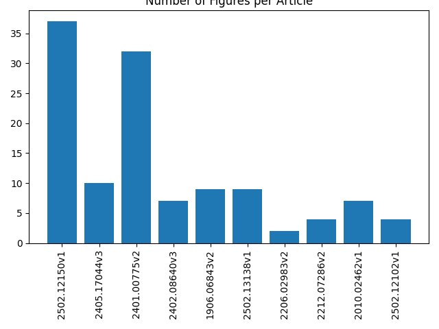

# AI and Open Science in Research Software Engineering
[](https://open-science-ai-rse.readthedocs.io/en/latest/?badge=latest)
[](https://doi.org/10.5281/zenodo.14962610)
## Description
This project, developed as part of my Computer Science coursework, focuses on the intersection of Artificial Intelligence and Open Science in the field of Research Software Engineering. The objective is to apply text analysis techniques to open-access research articles using Grobid. Key tasks include:

- **Extracting and processing the full text** from a set of 10 open-access research papers.
- **Generating insightful keyword clouds** based on abstracts to visualize key themes.
- **Visualizing the number of figures per article** to understand the use of visuals in research.
- **Compiling a comprehensive list of links** extracted from the papers, offering a deeper look into the references and connections within the research.


The project is designed to extract the data such as figures, links, and metadata from research papers, and it can be run either through Docker or a virtual environment.


## Recommended
* Ubuntu 22.04


# Setting Up the Environment

## Virtual Environment with Venv

To use venv for creating the virtual environment, first, you need to install the tool by running:

```bash
python3 -m pip install --user virtualenv
```

Once installed, create the virtual environment with:

```bash
python3 -m venv your_environment_name
```

Then, activate it:

```bash
source your_environment_name/bin/activate
```

With the environment activated, you need to install the necessary modules for running the program. To do so, use the provided `requirements.txt` file to install all the dependencies:

```bash
pip install -r requirements.txt
```

## Virtual Environment with Conda

If you prefer to use conda, you need to install Anaconda first. After installing, create the environment using the `environment.yml` file with:

```bash
conda env create -f environment.yml
```

Then, activate the environment:

```bash
conda activate open-science-env
```

Once everything is installed, you can run `pip freeze` to check that all dependencies have been installed correctly and proceed to execution.

## Run the Grobid Server

Start the Grobid server before running the script:

```bash
docker run -d --name grobid-server -p 8070:8070 -p 8071:8071 lfoppiano/grobid:0.8.0
```

This command runs the Grobid server in the background (`-d`).

## Execution Instructions

To run the program, simply place the articles you want to process in the `papers/` folder. The script will analyze these papers and store the xml results in the `output/` directory, and the keyword clouds, figures and links in the `results/` directory.

Execute the main script with the following command:

```bash
python3 scripts/main.py
```

This will run all the necessary scripts. After the execution, the results will be available in the `output/` directory, and additional processed results like figures and links can be found in the `results/` directory.

# Docker Installation Guide

## Prerequisites

Before running the project using Docker, ensure you have the following installed:

- **Docker**: Install it from the [official Docker website](https://www.docker.com/get-started).

## 1. Clone the Repository

Clone the project repository from GitHub:

```bash
git clone https://github.com/andreigrozescu/open-science-ai-rse.git
cd open-science-ai-rse
```

## 2. Build the Docker Image

Since the Dockerfile is already provided in the repository, run the following command to build the Docker image:

```bash
docker build -t open-science-ai-rse .
```

This command:

- Reads the Dockerfile.
- Pulls the Python 3.10 base image.
- Installs dependencies.
- Copies the project files.
- Creates the image `open-science-ai-rse`.

## 3. Verify the Image

Once the build is complete, verify that the image was created successfully:

```bash
docker images
```

You should see `open-science-ai-rse` listed.

## 4. Run the Grobid Server (Required for Processing)

Start the Grobid server before running the analysis:

```bash
docker run -d --name grobid-server -p 8070:8070 -p 8071:8071 lfoppiano/grobid:0.8.0
```

This command runs the Grobid server in the background (`-d`).

## 5. Run the Analysis Container

Now, run the project container, connecting it to the Grobid server:

```bash
docker run --rm --name paper_analysis --network="host" \    -v $(pwd)/papers:/app/papers \   -v $(pwd)/output:/app/output \      -v $(pwd)/results:/app/results \        open-science-ai-rse

```

### Explanation:

- `--rm`: Deletes the container after execution.
- `--network="host"`: Ensures the container can communicate with Grobid.
- `-v $(pwd)/papers:/app/papers`: Maps the local `papers/` folder to the container.
- `-v $(pwd)/output:/app/output`: Stores results in the local `output/` folder.


## Execution Example

Once the analysis process is completed, the results are stored in the `results/` directory. Below are the key outputs generated by the pipeline:

### Word Cloud  
A word cloud is generated based on the abstract text extracted from the analyzed papers.  
This visualization highlights the most frequently occurring words.  


---

### Figures Count  
The system detects and counts the number of figures present in each article.  
This helps in analyzing the visual content included in the papers.  



---

### Extracted Links  
A list of all hyperlinks found in the papers is stored in a text file.  
This provides an overview of referenced external sources.  


## License
Distributed under the [MIT License](https://opensource.org/license/mit). See [LICENSE](https://github.com/andreigrozescu/open-science-ai-rse/blob/main/LICENSE) for more information.

Author: Andrei Iulian Grozescu

Contact:  (andrei.grozescu@alumnos.upm.es)
